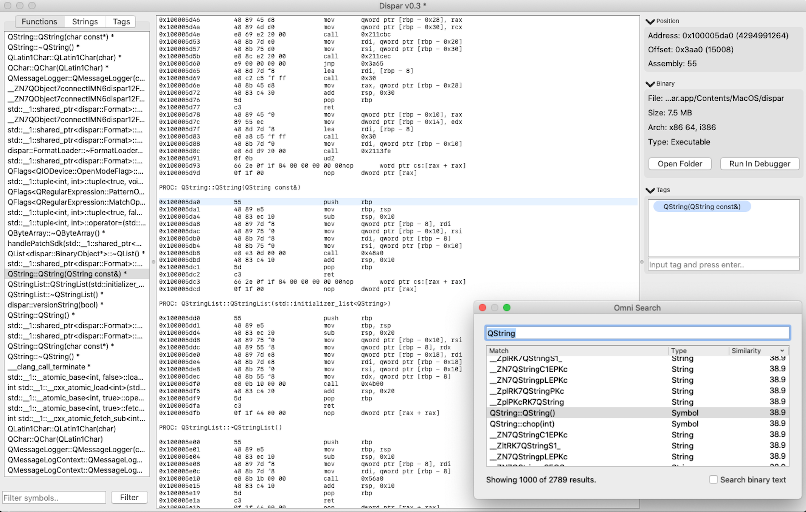
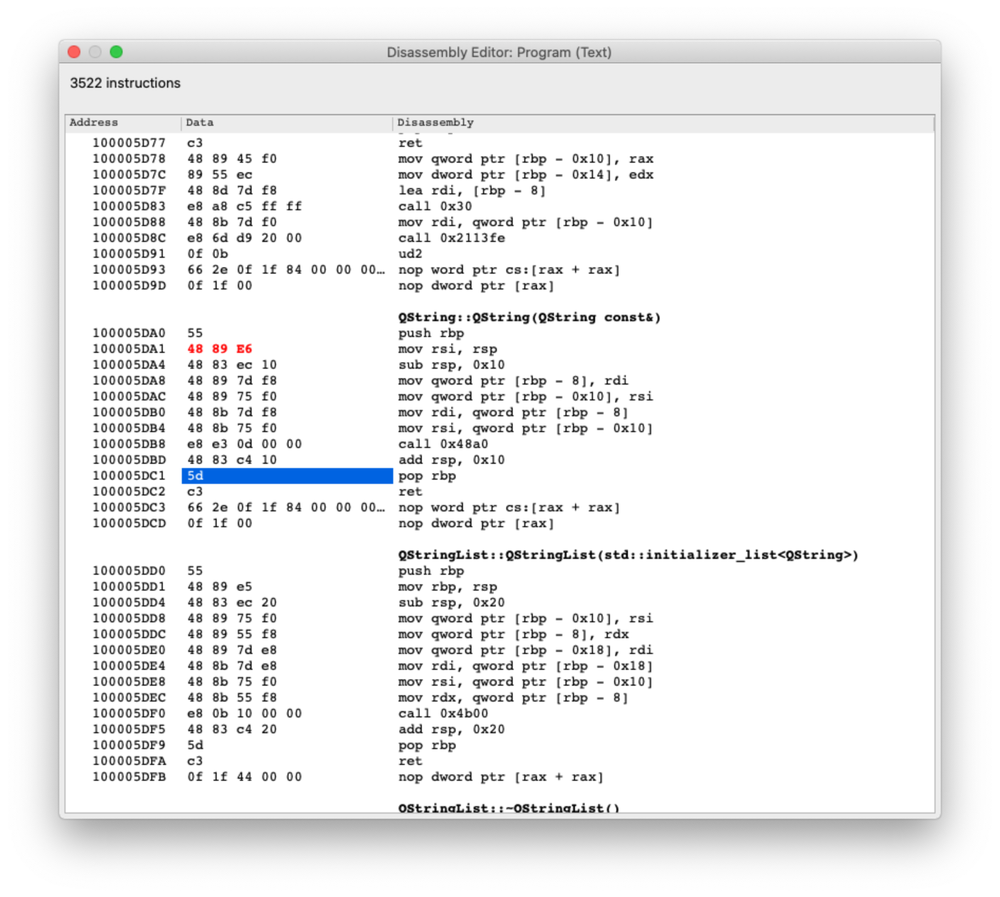
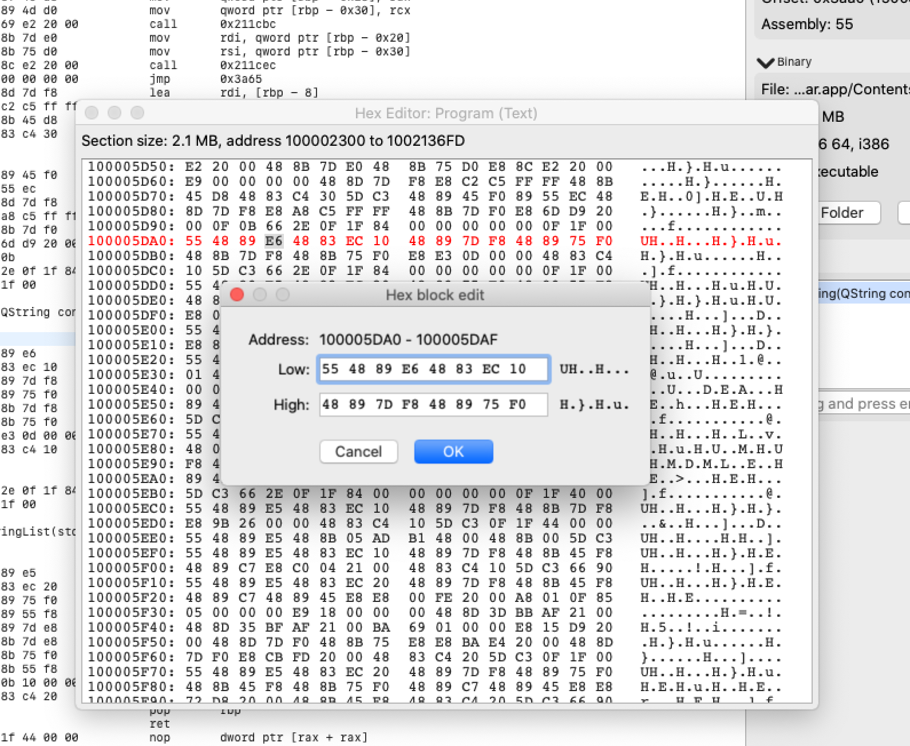

[](https://github.com/netromdk/dispar/actions/)
[](https://github.com/netromdk/dispar/actions/)
[](https://github.com/netromdk/dispar/security/code-scanning/)

# dispar
Dispar is short for "[Dis]assemling binary [Par]ser" written in C++17. The whole concept of the project is to load binaries, like executables, libraries, core dumps etc., and do analysis of their structure and data; most notably their strings, symbols, and functions. Currently, it supports only 32+64 bit [Mach-O](https://en.wikipedia.org/wiki/Mach-O) binaries (including [universal binaries](https://en.wikipedia.org/wiki/Universal_binary)) but there are plans for supporting [ELF](https://en.wikipedia.org/wiki/Executable_and_Linkable_Format) and [PE/PE+](https://en.wikipedia.org/wiki/Portable_Executable) later on.

# Table of Contents
* [Screenshots](#screenshots)
* [Dependencies](#dependencies)
  * [External](#external)
  * [Internal](#internal)
* [Building The Program](#building-the-program)
* [Testing](#testing)
* [Contributing](#contributing)
* [Advanced Topics](#advanced-topics)

# Screenshots






# Dependencies
There are both external and internal libraries and tools required to build and run this program.

## External
* CMake 3.12+
* Qt 5.15+
  * QtCore
  * QtGui
  * QtWidgets
  * QtPrintSupport (macOS only)
  * QtDBus (macOS and Linux)
  * QtXcbQpa (Linux only)
  * Arch-specific platform plugin: libqcocoa.dylib, qwindows.dll, or libqxcb.so
  * Arch-specific platform style: libqmacstyle.dylib, qwindowsvistastyle.dll
* Clang, llvm-profdata, and llvm-cov 4+ (for code coverage)
* Clang, scan-build 4+ (for static analysis)

## Internal
Located in the [lib](lib) folder:
* [Capstone](https://github.com/aquynh/capstone) (disassembler)
* [libiberty](https://github.com/gcc-mirror/gcc/tree/master/libiberty) (demangling)

# Building The Program
```
% ./init_repo.sh        # Only needed after first git clone!
% mkdir build
% cd build
% cmake ..
% make
```

This will create the dispar executable in "./bin/".

**NOTE: In the following all cmake invocations assume they're being run from the "./build" folder!**

# Testing
A suite of software tests can be run like this:
```
% cmake -DBUILD_TESTS=ON .
% make
% ./bin/tests
```

# Contributing
See [CONTRIBUTING.md](CONTRIBUTING.md).

# Advanced Topics
See [ADVANCED.md](ADVANCED.md).
